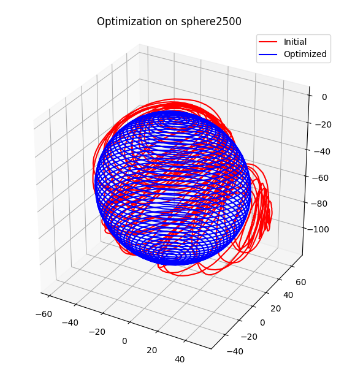

# jaxfg

<!-- vim-markdown-toc GFM -->

* [Preparation: Setting up a Python Virtual Environment](#preparation-setting-up-a-python-virtual-environment)
* [Installation](#installation)
* [Example scripts](#example-scripts)


<!-- vim-markdown-toc -->

**`jaxfg`** is a factor graph-based nonlinear least squares library for JAX.
Typical applications include sensor fusion, SLAM, bundle adjustment, optimal
control.

The premise: we provide a high-level interface for defining probability
densities as factor graphs. MAP inference reduces to nonlinear optimization,
which we accelerate by analyzing the structure of the graph. Repeated factor and
variable types have operations vectorized, and the sparsity of graph connections
is translated into sparse matrix operations.

Features:

- Autodiff-powered sparse Jacobians.
- Automatic vectorization for repeated factor and variable types.
- Manifold definition interface, with implementations provided for SO(2), SE(2),
  SO(3), and SE(3) Lie groups.
- Support for standard JAX function transformations: `jit`, `vmap`, `pmap`,
  `grad`, etc.
- Nonlinear optimizers: Gauss-Newton, Levenberg-Marquardt, Dogleg.
- Sparse linear solvers: conjugate gradient (Jacobi-preconditioned), sparse
  Cholesky (via CHOLMOD).

This library is released as part of our IROS 2021 paper (more info in our core
experiment repository [here](https://github.com/brentyi/dfgo)) and borrows
heavily from a wide set of existing libraries, including
[GTSAM](https://gtsam.org/), [Ceres Solver](http://ceres-solver.org/),
[minisam](https://github.com/dongjing3309/minisam),
[SwiftFusion](https://github.com/borglab/SwiftFusion), and
[g2o](https://github.com/RainerKuemmerle/g2o). For technical background and
concepts, GTSAM has a
[great set of tutorials](https://gtsam.org/tutorials/intro.html).


### Preparation: Setting up a Python Virtual Environment

Before installing the required packages, it's recommended to create a Python virtual environment. This helps avoid conflicts with other installed packages and allows for a clean workspace. To create a virtual environment:

```bash
git clone git@github.com:zczqwc0/COMP0132_Differentiable-filter-SLAM_2022-2023.git
cd COMP0132_Differentiable-filter-SLAM_2022-2023/jaxfg
python3 -m venv jaxfg_env
source jaxfg_env/bin/activate
```

### Installation

`scikit-sparse` require SuiteSparse:

```bash
sudo apt update
sudo apt install -y libsuitesparse-dev
```

Then, from your environment of choice:

```bash
pip install -e .
pip install scikit-learn
pip install tensorflow
```

### Example scripts

Toy pose graph optimization:

```bash
python scripts/pose_graph_simple.py
```

Pose graph optimization from `.g2o` files:

```bash
python scripts/pose_graph_g2o.py  # For options, pass in a --help flag
```




